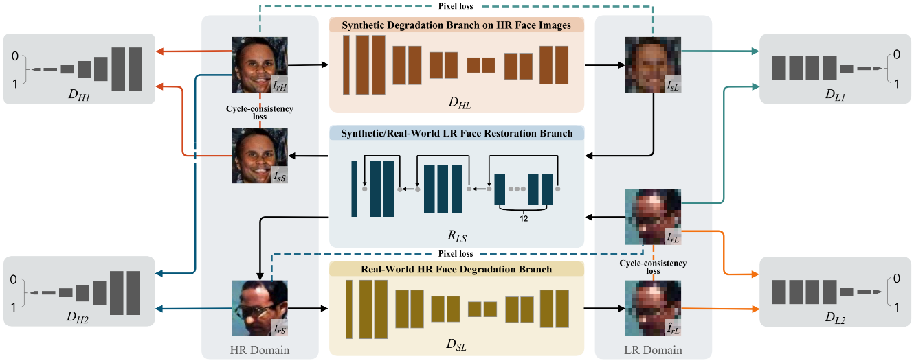

# Semi-Cycled Generative Adversarial Networks for Real-World Face Super-Resolution



**Figure:** *Architecture of the Semi-Cycled Generative Adversarial Network (SCGAN) for unsupervised face super resolution.*

We establish two independent degradation branches in the forward and backward cycle-consistent reconstruction processes, respectively, while the two processes share the same restoration branch. Our Semi-Cycled Generative Adversarial Networks (SCGAN) is able to alleviate the adverse effects of the domain gap between the real-world LR face images and the synthetic LR ones, and to achieve accurate and robust face SR performance by the shared restoration branch regularized by both the forward and backward cycle-consistent learning processes.

> **Semi-Cycled Generative Adversarial Networks for Real-World Face Super-Resolution** <br>
> [H Hou](https://scholar.google.com/citations?user=KuStHcwAAAAJ&hl=zh-CN), [J Xu](https://scholar.google.com/citations?user=O6TnZ9EAAAAJ&hl=zh-CN), [Y Hou](https://scholar.google.com/citations?user=idqA4UcAAAAJ&hl=zh-CN), X Hu, B Wei, [D Shen](https://scholar.google.com/citations?user=v6VYQC8AAAAJ&hl=zh-CN) <br>
> **IEEE Transactions on Image Processing**

[[Arxiv](https://arxiv.org/pdf/2205.03777.pdf)]
[[Paper](https://ieeexplore.ieee.org/abstract/document/10036448)]
[[Project Page](https://github.com/HaoHou-98/SCGAN)]

## Installation

Clone this repo.
```bash
git clone https://github.com/HaoHou-98/SCGAN.git
cd SCGAN/
```

 Please install dependencies by
```bash
pip install -r requirements.txt
```


## Dataset Preparation

The prepared test set and trainning set can be directly downloaded [here](https://drive.google.com/file/d/12FURoPwr6G1j3DOOsgIYQSnXxg8mR0qU/view?usp=sharing). After unzipping, put the `imgs_test` and `imgs_train` folders in the root directory.

## Pre-trained Model Preparation

The pre-trained model can be directly downloaded [here](https://drive.google.com/file/d/1n9WZocClRdx7OdCXj6hGJNZ4zev4U7t3/view?usp=sharing). After unzipping, put the `pretrained_model` folder in the root directory.

## Super-resolving Images Using Pretrained Model

Once the dataset and the pre-trained model are prepared, the results be got using pretrained model.


1. Inference.

    ```
    python test.py
    ```

2. The results are saved at `./test_results/`.

## Training New Models

To train the new model, you need to put your own high-resolution and low-resolution face images into `./imgs_train/HIGH` and `./imgs_train/LOW`, respectively, and then
```bash
python train.py
```
The models are saved at `./train/models`


## Other Models
Will be released soon.


## Citation
If you use this code for your research, please cite our papers.
```
@ARTICLE{10036448,
  author={Hou, Hao and Xu, Jun and Hou, Yingkun and Hu, Xiaotao and Wei, Benzheng and Shen, Dinggang},
  journal={IEEE Transactions on Image Processing}, 
  title={Semi-Cycled Generative Adversarial Networks for Real-World Face Super-Resolution}, 
  year={2023},
  volume={32},
  number={},
  pages={1184-1199},
  doi={10.1109/TIP.2023.3240845}}
```
The code is released for academic research use only.
